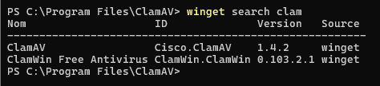
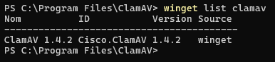
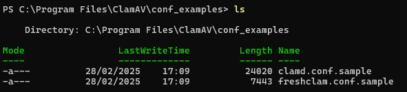
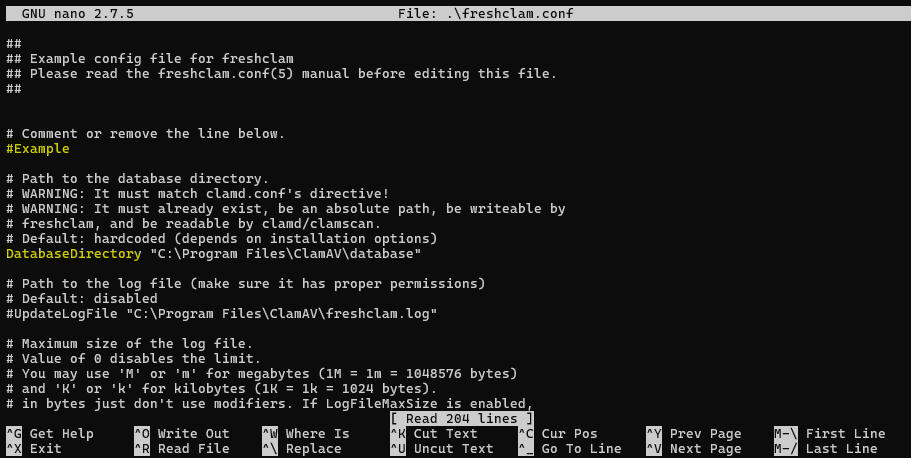
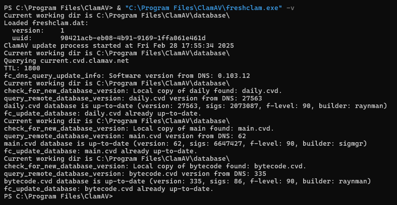
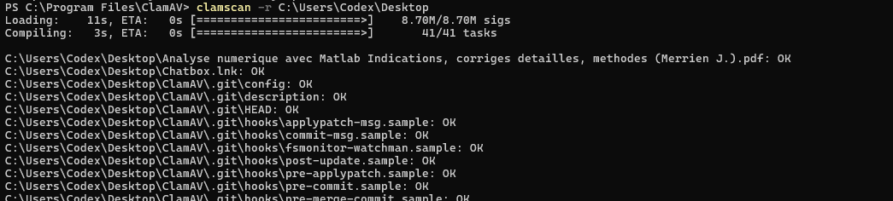
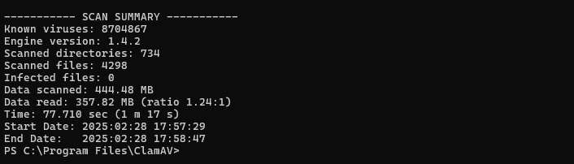

# ClamAV
ClamAv_Usage

# Sur Linux

## Installation:
```sudo apt update && sudo apt install clamav -y```

## Mis à jour des signatures:
```sudo freshclam```

## Scanner un dossier spécifique :
```clamscan -r /home/user/Documents```

## Scanner et supprimer les fichiers infectés automatiquement :
```clamscan -r --remove=yes /home/user/Documents```

## Vérifier si freshclam tourne avec systemd:
```sudo systemctl start clamav-freshclam```
```sudo systemctl restart clamav-freshclam```
```sudo freshclam```


# Sur Windos
Installer clamAv via l'invite de commande winget:

Vérifier que clamAV abien été installé via la commande:
```winget list clamav```


# Ajouter en variable d'environnement via:
```setx PATH "$env:Path;C:\Program Files\ClamAV" /M```
# Mettre à jour la signature de clamAV:
Naviguer dans le dossier C:\Program Files\ClamAV\conf_examples

Copier-coller le fichier **freshclam.conf.sample** dans le dossier racine C:\Program Files\ClamAV\
Puis renommer le en **freshclam.conf** en décommentant le chemin de la base de donnée (Assurez vous que la ligne Example soit commenté #Example).


```& "C:\Program Files\ClamAV\freshclam.exe" -v```


# Lancer le scan sur Windows via posershell:
```clamscan -r C:\Users\"votre_nom_utilisateur"\Desktop```


